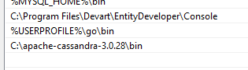
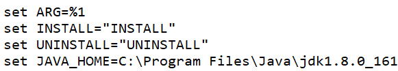
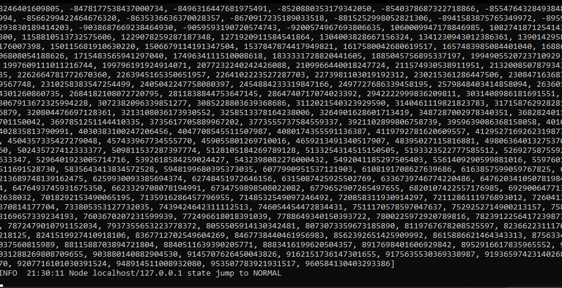

<!---DIVISION-->

# Investigación Ingeniería de Software
<h2 align="center">
Golang + Cassandra
</h2>
<p align="center">   
<br> Estudiantes: <br> <br>
<table align="center">
	<tbody>
		<tr>
			<td>Allán Fabián Trejos Salazar</td>
			<td>C07870</td>
		</tr>
		<tr>
			<td>Luis Arguedas Villalobos</td>
			<td>C00648</td>
		</tr>
	</tbody>
</table>
</p>
<p align="center">   
Profesor: <br> <br>
MSc. Leonardo Camacho Navarro <br><br>
</p>

<h2 align="center"> 
Universidad de Costa Rica, 2023
</h2>

***

<!---DIVISION-->

**Índice**
1. [Instalaciones necesarias](#Instalacion)
2. [Extensiones Golang para APIs](#Extensiones)

<!---DIVISION-->

<div id='Instalacion'>

# Instalación Golang y Cassandra

## Instalación Golang

Para descargar Golang es necesario acceder al [link](https://go.dev/dl/) y descargar la versión más reciente con respecto al Sistema Operativo que actualmente se utiliza. Posteriormente a la descarga, se abre el archivo exe, se selecciona la ubicación donde se instalará el compilador y finalmente se instalara sin solicitar ninguna información demás.

## Instalación Cassandra

La última versión con soporte para Windows de Cassandra es Apache Cassandra 3.0, por lo tanto, al ingresar a la sección de [descargas](https://cassandra.apache.org/_/download.html) de Apache Cassandra seleccionaremos la opción 3.0 de Octubre 23, 2022. 

```
Es necesario tener Python y un JDK instalado para ejecutar Cassandra localmente
```

En sistemas de producción donde el uso de Cassandra es sí o sí necesario, se recomienda la instalación a través de imagenes de Docker o directamente utilizar una máquina con cualquier sistema Linux.

Tras extraer los archivos descargados y moverlos a un lugar seguro, es necesario añadir una variable de sistema en la sección temp de Windows, que rediriga a la carpeta bin dentro del lugar donde Cassandra fue instalado

<p align="center">

</p>

Una vez agregada la variable de entorno en el sistema, es necesario hacer modificaciones en el archivo cassandra.bat. Se debera de añadir la dirección donde se encuentra el jdk de la computadora que actualmente estamos utilizando. La línea de código se deberá añadir desde cero, por lo que la estructura de esta será:

```
set JAVA_HOME=DIRECCIÓN_DE_JDK
```

<p align="center">

</p>


Finalmente, para verificiar que la instalación de Cassandra Db fue realizada con éxito, se deberá de ingresar a través de CMD de Windows a la carpeta donde se guardo el Cassandra, especificamente a la carpeta bin y ejecutar el commando:

```
Cassandra
```

<p align="center">
 <p>Node localhost/127.0.0.1 state jump to NORMAL</p>
</p>


</div>
<!---DIVISION-->
<div id='Extensiones'>

# Extensiones Golang

## Instalar Go Mux

Go Mux es una extensión que ayuda a manejar direcciones HTTP para la creación de APIs en Golang.

Para su instalación es necesario ejecutar el siguiente comando en consola: 

```
go get -u github.com/gorilla/mux
```

Para abrir un servidor local que ejecute la API se debe de correr el comando:

```
go run .
```

Este comando ejecutará todos los archivos con extensión .go que se encuentren dentro de la dirección.

## Instalar Compile Demon

En el camino se harán muchos cambios en los endpoints, por lo que cancelar la ejecución del servidor para después volverlo a ejecutar no es una opción. Compile Demon facilita esta tarea a través de guardar los cambios en los endpoints y re ejecutar el servidor. Para instalar esta herramienta se debe de correr el siguiente comando en consola:

```
go install github.com/githubnemo/CompileDaemon
```

Para asignar el .exe creado a un comando, se debe ejecutar:

```
CompileDaemon -command="Nombre del EXE"
```

## Controlador para conectar con Cassandra

En el caso de Cassandra, es necesario instalar un controlador (gocql) que sea capaz de enviar las queries para que posteriormente sean ejecutadas por el gestor de bases de datos. El comando para instalar el conector es:

```
go get github.com/gocql/gocql
```
</div>
