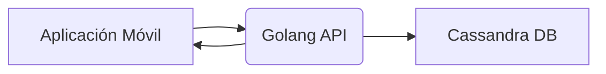

<!---DIVISION-->

# Investigación Ingeniería de Software
<h2 align="center">
Golang + Cassandra
</h2>
<p align="center">   
<br> Estudiantes: <br> <br>
<table align="center">
	<tbody>
		<tr>
			<td>Allán Fabián Trejos Salazar</td>
			<td>C07870</td>
		</tr>
		<tr>
			<td>Luis Arguedas Villalobos</td>
			<td>C00648</td>
		</tr>
	</tbody>
</table>
</p>
<p align="center">   
Profesor: <br> <br>
MSc. Leonardo Camacho Navarro <br><br>
</p>

<h2 align="center"> 
Universidad de Costa Rica, 2023
</h2>

***

<!---DIVISION-->

**Índice**
1. [Instalaciones necesarias](#Instalacion)
2. [Extensiones Golang para APIs](#Extensiones)
3. [Integración](#Integracion)
4. [Guia de Investigación](#Guia)
5. [Referencias](#Referencias)

<!---DIVISION-->

<div id='Instalacion'>

# Instalación Golang y Cassandra

## Instalación Golang

Para descargar Golang es necesario acceder al [link](https://go.dev/dl/) y descargar la versión más reciente con respecto al Sistema Operativo que actualmente se utiliza. Posteriormente a la descarga, se abre el archivo exe, se selecciona la ubicación donde se instalará el compilador y finalmente se instalara sin solicitar ninguna información demás.

## Instalación Cassandra

La última versión con soporte para Windows de Cassandra es Apache Cassandra 3.0, por lo tanto, al ingresar a la sección de [descargas](https://cassandra.apache.org/_/download.html) de Apache Cassandra seleccionaremos la opción 3.0 de Octubre 23, 2022. 

```
Es necesario tener Python y un JDK instalado para ejecutar Cassandra localmente
```

En sistemas de producción donde el uso de Cassandra es sí o sí necesario, se recomienda la instalación a través de imagenes de Docker o directamente utilizar una máquina con cualquier sistema Linux.

Tras extraer los archivos descargados y moverlos a un lugar seguro, es necesario añadir una variable de sistema en la sección temp de Windows, que rediriga a la carpeta bin dentro del lugar donde Cassandra fue instalado

<p align="center">

</p>

Una vez agregada la variable de entorno en el sistema, es necesario hacer modificaciones en el archivo cassandra.bat. Se debera de añadir la dirección donde se encuentra el jdk de la computadora que actualmente estamos utilizando. La línea de código se deberá añadir desde cero, por lo que la estructura de esta será:

```
set JAVA_HOME=DIRECCIÓN_DE_JDK
```

<p align="center">

</p>


Finalmente, para verificiar que la instalación de Cassandra Db fue realizada con éxito, se deberá de ingresar a través de CMD de Windows a la carpeta donde se guardo el Cassandra, especificamente a la carpeta bin y ejecutar el commando:

```
Cassandra
```

<p align="center">
 <p>Node localhost/127.0.0.1 state jump to NORMAL</p>
</p>


</div>
<!---DIVISION-->
<div id='Extensiones'>

# Extensiones Golang

## Instalar Go Mux

Go Mux es una extensión que ayuda a manejar direcciones HTTP para la creación de APIs en Golang.

Para su instalación es necesario ejecutar el siguiente comando en consola: 

```
go get -u github.com/gorilla/mux
```

Para abrir un servidor local que ejecute la API se debe de correr el comando:

```
go run .
```

Este comando ejecutará todos los archivos con extensión .go que se encuentren dentro de la dirección.

## Instalar Compile Demon

En el camino se harán muchos cambios en los endpoints, por lo que cancelar la ejecución del servidor para después volverlo a ejecutar no es una opción. Compile Demon facilita esta tarea a través de guardar los cambios en los endpoints y re ejecutar el servidor. Para instalar esta herramienta se debe de correr el siguiente comando en consola:

```
go install github.com/githubnemo/CompileDaemon
```

Para asignar el .exe creado a un comando, se debe ejecutar:

```
CompileDaemon -command="Nombre del EXE"
```

## Controlador para conectar con Cassandra

En el caso de Cassandra, es necesario instal ar un controlador (gocql) que sea capaz de enviar las queries para que posteriormente sean ejecutadas por el gestor de bases de datos. El comando para instalar el conector es:

```
go get github.com/gocql/gocql
```
</div>

<!---DIVISION-->

<div id='Integracion'>

# Integración

Las aplicaciones estarán directamente conectadas con una API Golang que resolverá sus consultas y devolverá la información necesaria para que todo funcione correctamente. Esta API Golang se encargará de consultar la base de datos Cassandra DB para obtener los datos que precisa el cliente. En resumen, el flujo se vería de esta forma:



## Configuración en Golang

Tras crear la base de datos en Cassandra DB es necesario crear una función en Golang que sea capaz de retornar una sesión desde la que se consultará directamente a la base de datos toda la información que requiera la API. Tal función lucirá de la siguiente forma:

```GO
func getSession() *gocql.Session {
	cluster := gocql.NewCluster("IP")
	cluster.Keyspace = "KeySpace"
	cluster.Timeout = time.Second * 60
	session, _ := cluster.CreateSession()
	return session
}
```

Es necesario recalcar que la IP dependerá totalmente de donde está hosteada la base de datos, así mismo como el nombre del Keyspace, que es el lugar dentro del nodo donde se encuentra la información necesaria.

Aparecerá un error, debido a que no se cuenta con la librería gocql instalada en la aplicación golang, por lo que es necesario correr el siguiente código en terminal:

```
go get github.com/gocql/gocql
```

A partir de este punto basta con crear cada uno de los endpoints del CRUD. Tomaremos como ejemplo el getTask de este proyecto:

```GO
func getTask(w http.ResponseWriter, r *http.Request) {
	vars := mux.Vars(r)
	name := vars["name"]

	session := getSession()
	defer session.Close()

	var t task
	query := "SELECT * FROM control_tareas.tareas WHERE \"Name\" = ? LIMIT 1"
	if err := session.Query(query, name).Consistency(gocql.One).Scan(&t.ID, &t.Name, &t.Content); err != nil {
		http.Error(w, err.Error(), http.StatusInternalServerError)
		return
	}
	w.Header().Set("Content-Type", "application/json")
	json.NewEncoder(w).Encode(t)

}
```

A partir de este punto analizaremos las siguientes lineas de código:

__vars := mux.Vars(r):__ la libreria Mux se encargará de convertir cada uno de los atributos que reciba de la solicitud que envie el cliente en un arreglo Llave, Atributo. Es por esta razón que en la siguiente línea se obtiene lo que tiene el arreglo, específicamente con la llave [name].

__session := getSession():__ inicia una sesión de la función que anteriormente fue creada.

__w.Header().Set("Content-Type", "application/json"):__ lo que retornará el método estará en formato json.

__json.NewEncoder(w).Encode(t):__ asigna el valor que encontró tras ejecutar el query a la respuesta del método Http y lo codifica en formato json.

</div>

<!---DIVISION-->

<div id='Guia'>

# Guia de Investigación

1. ¿Cuáles son las mayores ventajas de Cassandra? 
2. Cassandra utiliza un modelo P2P ¿Que ventajas y desventajas provee este modelo sobre otros que utilizan MySQL como ejemplo?
3. ¿Cómo garantiza Cassandra la alta disponibilidad y escalabilidad?
4. Cassandra se encarga de hacer replicación de datos ¿Cómo lo realiza?
5. ¿Qué es el modelo de consistencia eventual con el que cuenta Cassandra DB?
6. En cuanto al rendimiento, ¿Cuál es la mayor diferencia de Cassandra DB con respecto a otros sistemas de bases de datos?
7. ¿Que beneficios ofrece Golang sobre Java y Python?
8. Con tener conocimientos intermedios en C++/C es sencillo programar y aprender a utilizar el lenguaje Go ¿Por qué es tan similar Go de estos otros lenguajes?
9. El código de las librerías de Go en su mayoría se descargan de repositorios de Github ¿Considera el sistema de administración y descarga de librerias de golang una desventaja?
10. ¿Por qué nació Golang? ¿Cuál fue esa necesidad que potenció su desarrollo y posterior nacimiento?
11. ¿Qué tan dificil es desarrollar interfaces de usuario en Golang? ¿Acaso es un lenguaje enfocado únicamente en back-end?
12. ¿Qué diferencias ofrece Golang con respecto a otros lenguajes hablando de concurrencia?
13. A través de internet es sencillo encontrar varias librerías que favorecen al desarollo de aplicaciones móviles; sin embargo, la mayoría de ellas están en desuso o desactualizadas ¿Cuál es la librería que se utiliza mayoritariamente para este propósito?
14. ¿Cuál considera que es el futuro del lenguaje Go? ¿Cree que peleará en un futuro con lenguajes como Javascript?


</div>

<!---DIVISION-->

<div id='Referencias'>

# Referencias
* [Casos de Estudio Golang](https://go.dev/solutions/case-studies)
* [Aprovechar Golang para el desarrollo y las operaciones de juegos](https://technology.riotgames.com/news/leveraging-golang-game-development-and-operations)
* [Introducción a Apache Cassandra](https://aprenderbigdata.com/introduccion-apache-cassandra/)
* [Cassandra Basics](https://cassandra.apache.org/_/cassandra-basics.html)
* [Top Benefits Apache Cassandra](https://cassandra.apache.org/_/cassandra-basics.html)
* [Golang, REST API CRUD con go](https://www.youtube.com/watch?v=pQAV8A9KLwk&ab_channel=FaztCode)
</div>
